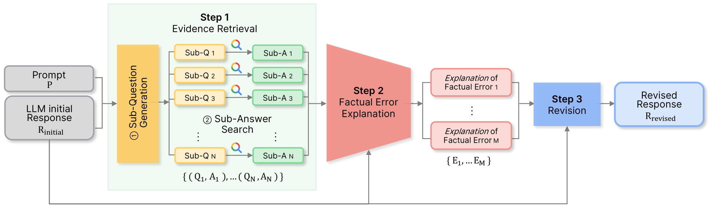

# [ICLRW'24] Re-Ex: Revising after Explanation reduces the Factual Errors in LLM Responses
[](https://arxiv.org/abs/2402.17097)

Official Repository for our paper  **Re-Ex: Revising after Explanation reduces the Factual Errors in LLM Responses** in **ICLR 2024 Workshop on Reliable and Responsible Foundation Models** ([ICLR'24 R2-FM Workshop](https://iclr-r2fm.github.io))



## Citation
```
@article{
kim2024reex,
title={Re-Ex: Revising after Explanation reduces the Factual Errors in {LLM} Responses},
author={Juyeon Kim and Jeongeun Lee and YoonHo Chang and CHANYEOL CHOI and Jun-Seong Kim and Jy-yong Sohn},
booktitle={ICLR 2024 Workshop on Reliable and Responsible Foundation Models},
year={2024},
}
```
